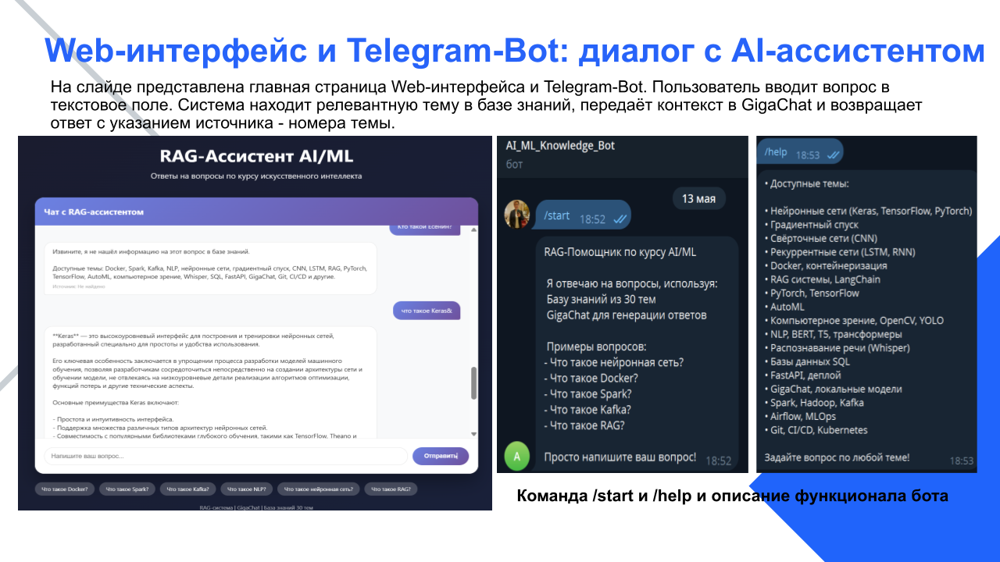
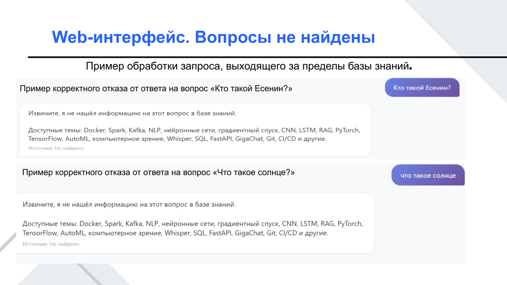
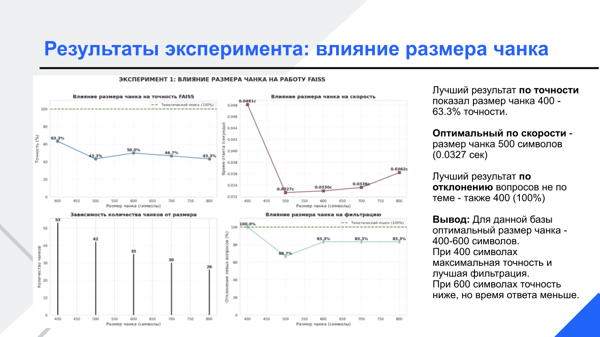

# RAG-AI-ML
# RAG-система для автоматического поиска и генерации ответов по документации курса AI/ML

Данный проект — это моя дипломная работа. Это RAG-система (Retrieval-Augmented Generation), которая отвечает на вопросы по 30 темам курса AI/ML через удобные Telegram-бота и веб-интерфейс. Система использует тематический поиск для точного нахождения контекста и языковую модель GigaChat для генерации ответов без "галлюцинаций".


## Живое демо

- **Попробовать веб-интерфейс:** [Веб-интрефейс](https://rag-ai-ml-egvefzmes5tf8x29sdyvm3.streamlit.app/)
- **Telegram-бот:** [@AI_ML_Knowledge_bot](https://t.me/aiml_knowledge_bot)
  
---

## Скриншоты

| Веб-интерфейс | Telegram-бот | Отказ при вопросе вне базы |
| :---: | :---: | :---: |
|  |  |  |

---

## Основные возможности

*   **Точность и надежность:** Отвечает строго на основе загруженной базы знаний из 30 тем, исключая "галлюцинации" LLM.
*   **Два интерфейса:** Удобный веб-чат и Telegram-бот для доступа с любых устройств.
*   **Интеллектуальный поиск:** Использует **тематический поиск**, который показал 100% точность на текущем объеме данных.
*   **Прозрачность:** Все ответы сопровождаются ссылкой на источник (номер темы).
*   **Готовность к масштабированию:** Архитектура спроектирована с возможностью перехода на гибридный поиск (BM25 + векторный) для больших баз знаний.

---

## Стек технологий

Здесь перечислены все основные инструменты, которые были использованы в проекте.

*   **Язык программирования:** Python 3.10+
*   **База знаний:** Pandas, NumPy (для структурирования данных)
*   **Поиск:** FAISS (для экспериментов), реализован кастомный тематический поиск
*   **LLM:** GigaChat (через API)
*   **Бэкенд и API:** FastAPI
*   **Интерфейсы:**
    *   Веб-интерфейс: Streamlit (или React/Vue.js, укажите ваш вариант)
    *   Telegram-бот: `aiogram` (или `python-telegram-bot`)
*   **Инструменты:** Docker, Git

---

## Архитектура системы

*Краткое описание потока данных:*
1.  Пользователь отправляет вопрос через Web или Telegram.
2.  Система определяет наиболее релевантную тему в базе знаний (тематический поиск).
3.  Извлеченный контекст (текст темы) вместе с вопросом пользователя передается в GigaChat.
4.  GigaChat генерирует ответ на основе предоставленного контекста.
5.  Ответ возвращается пользователю вместе с указанием источника (темы).

---

## Сравнение методов поиска (Эксперименты)

В рамках работы был проведен эксперимент по сравнению векторного поиска (FAISS) и тематического поиска.

| Метод | Точность | Время ответа (среднее) | Комментарий |
| :--- | :--- | :--- | :--- |
| **FAISS** | **63.3%** | ~0.03 сек | Показал ограниченную эффективность на малом объеме данных (35 чанков). |
| **Тематический поиск** | **100%** | **~0.001 сек** | Превзошел FAISS по всем параметрам для данной базы знаний. |

### Влияние размера чанка (chunk_size) на точность FAISS


*Оптимальный размер чанка для данной базы составил 400 символов (точность 63.3%).*

---

## Быстрый старт (Локальный запуск)

Следуйте инструкциям ниже, чтобы развернуть проект на своем компьютере.

### Предварительные требования
*   Установленный Python 3.10+
*   Аккаунт и API-ключ для доступа к GigaChat

### Установка

1.  **Клонируйте репозиторий:**
    ```bash
    git clone https://github.com/your-username/your-repo-name.git
    cd your-repo-name
