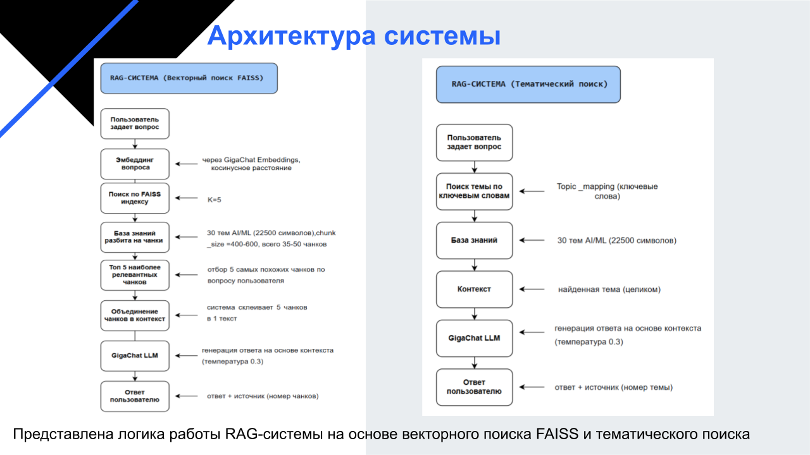
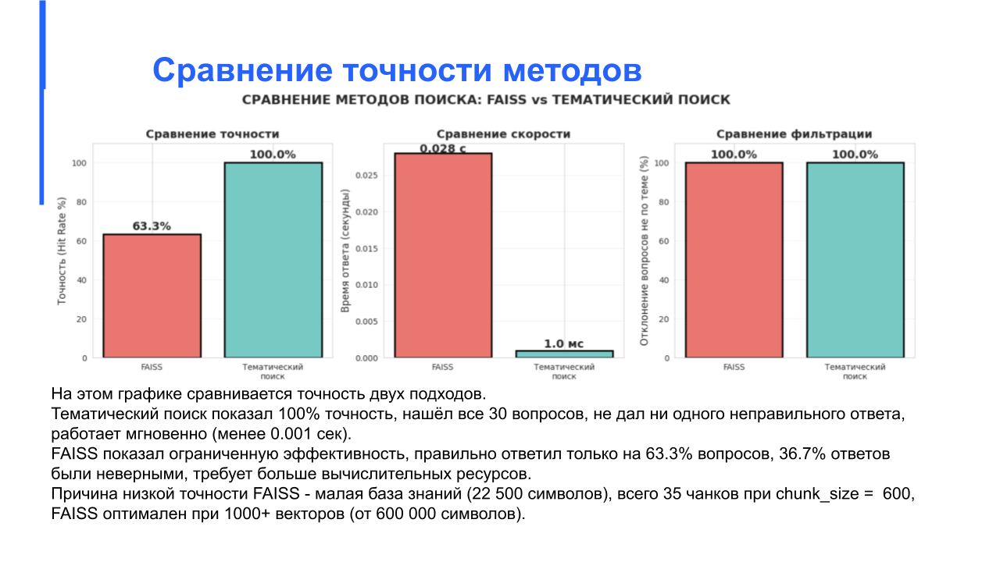

# RAG-AI-ML
RAG-система для автоматического поиска и генерации ответов по документации курса AI/ML

Данный проект — это моя дипломная работа. Это RAG-система (Retrieval-Augmented Generation), которая отвечает на вопросы по 30 темам курса AI/ML через удобные Telegram-бота и веб-интерфейс. Система использует тематический поиск для точного нахождения контекста и языковую модель GigaChat для генерации ответов без "галлюцинаций".

## Живое демо

- **Попробовать веб-интерфейс:** [Веб-интрефейс](https://rag-ai-ml-egvefzmes5tf8x29sdyvm3.streamlit.app/)
- **Telegram-бот:** [@AI_ML_Knowledge_bot](https://t.me/aiml_knowledge_bot) 

---

## Скриншоты

### Веб-интерфейс: Главный экран и пример диалога


*Главный экран веб-интерфейса RAG-Ассистента*

---

### Telegram-бот: Пример диалога


*Пример успешного диалога с Telegram-ботом*

---

### Корректный отказ при вопросе вне базы знаний


*Бот корректно отвечает, что не нашёл информацию в базе знаний*

---

#### Дополнительные материалы

### Архитектура системы
На схеме показано сравнение двух подходов к построению RAG: векторный поиск FAISS и кастомный тематический поиск.



---

### Сравнение методов поиска
Графики демонстрируют превосходство тематического поиска над FAISS по точности (100% против 63.3%) и скорости.



---

## Основные возможности

- **Точность и надежность:** Отвечает строго на основе загруженной базы знаний из 30 тем, исключая "галлюцинации" LLM.
- **Два интерфейса:** Удобный веб-чат и Telegram-бот для доступа с любых устройств.
- **Интеллектуальный поиск:** Использует трёхуровневый гибридный поиск (по ключевым словам, по содержанию текста и по заголовку).
- **Прозрачность:** Все ответы сопровождаются ссылкой на источник (номер темы).
- **Готовность к масштабированию:** Архитектура спроектирована с возможностью перехода на гибридный поиск (BM25 + векторный) для больших баз знаний.

---

## Стек технологий

Здесь перечислены все основные инструменты, которые были использованы в проекте.

- **Язык программирования:** Python 3.12+
- **База знаний:** Структурированный текстовый файл (RAG_KNOWLEDGE_BASE.txt) с 30 темами.
- **Поиск:** Реализован кастомный трёхуровневый тематический поиск (по ключевым словам, по содержанию текста, по заголовку).
- **LLM:** GigaChat (через API)
- **Бэкенд и API:** Flask (для поддержания активности Telegram-бота в облаке).
- **Интерфейсы:**
  - Веб-интерфейс: Streamlit
  - Telegram-бот: `python-telegram-bot`
- **Инструменты:** Git, Docker (для локальной сборки)
- **Деплой:**
  - **Веб-приложение:** Задеплоено на **Streamlit Cloud**.
  - **Telegram-бот:** Задеплоен на **Railway** (работает 24/7 без простоев).

---

## Архитектура системы

Краткое описание потока данных:

1. Пользователь отправляет вопрос через Web или Telegram.
2. Система определяет наиболее релевантную тему в базе знаний (тематический поиск).
3. Извлеченный контекст (текст темы) вместе с вопросом пользователя передается в GigaChat.
4. GigaChat генерирует ответ на основе предоставленного контекста.
5. Ответ возвращается пользователю вместе с указанием источника (темы).

---

## Сравнение методов поиска (Эксперименты)

В рамках работы был проведен эксперимент по сравнению векторного поиска (FAISS) и тематического поиска.

| Метод | Точность | Время ответа (среднее) | Комментарий |
| :--- | :--- | :--- | :--- |
| FAISS | 63.3% | ~0.03 сек | Показал ограниченную эффективность на малом объеме данных (35 чанков). |
| Тематический поиск | 100% | ~0.001 сек | Превзошел FAISS по всем параметрам для данной базы знаний. |

### Влияние размера чанка (chunk_size) на точность FAISS


*Оптимальный размер чанка для данной базы составил 400 символов (точность 63.3%).*

---

## Быстрый старт (Локальный запуск)

Следуйте инструкциям ниже, чтобы развернуть проект на своем компьютере.

### Предварительные требования
- Установленный Python 3.12+
- Аккаунт и API-ключ для доступа к GigaChat

### Установка

1. Клонируйте репозиторий:
   ```bash
   git clone https://github.com/Alina-cyber1/RAG-AI-ML.git
   cd RAG-AI-ML
