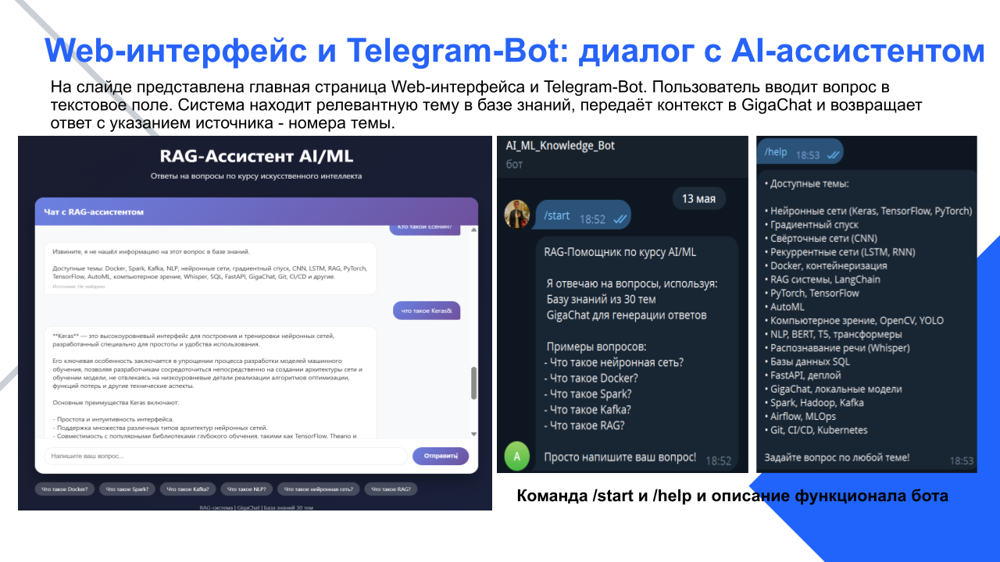
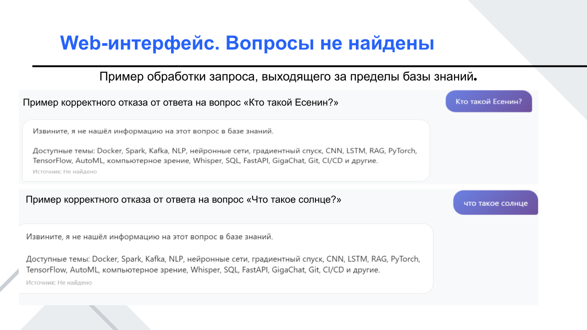
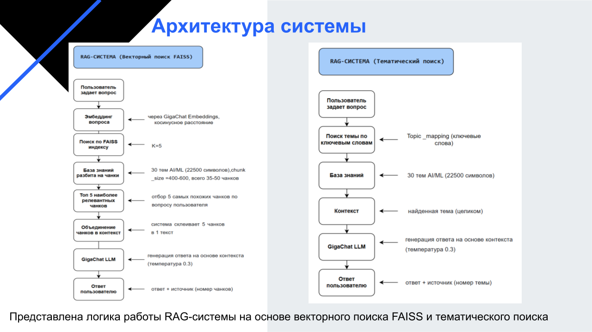
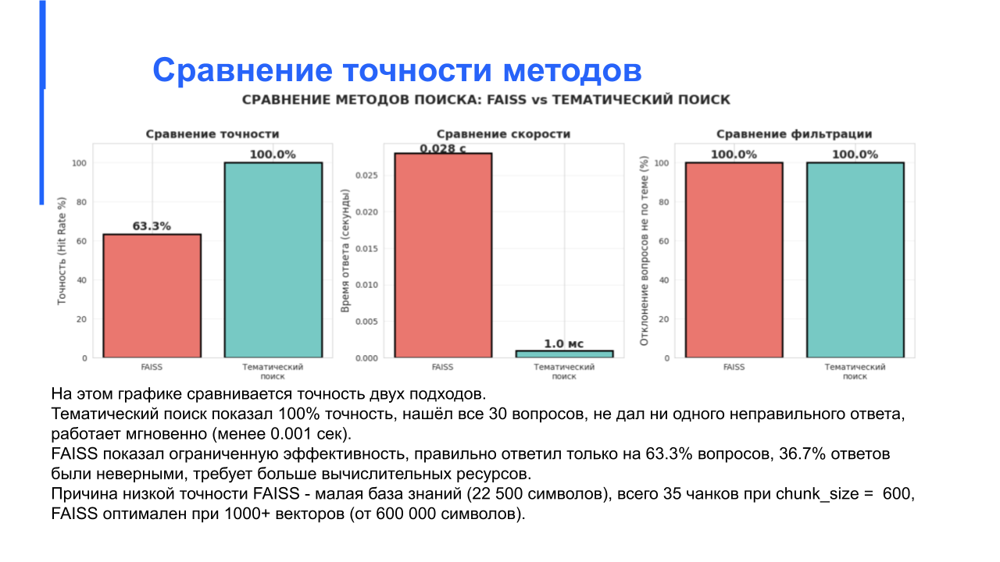
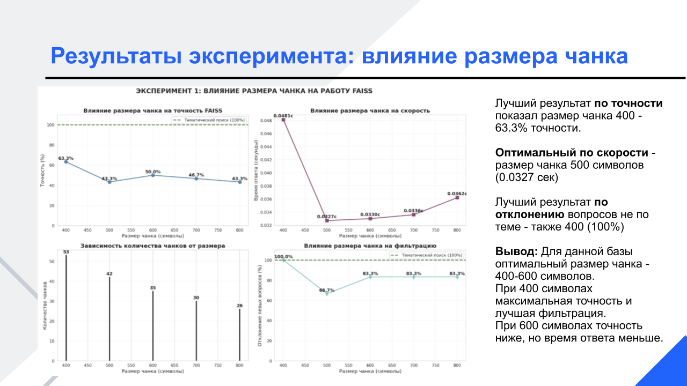

# RAG-AI-ML


RAG-система для автоматического поиска и генерации ответов по документации курса AI/ML.

## Живое демо

- **Попробовать веб-интерфейс:** [Веб-интрефейс](https://rag-ai-ml-egvefzmes5tf8x29sdyvm3.streamlit.app/)
- **Веб-интерфейс:** [RAG-Ассистент на Streamlit Cloud](https://rag-ai-ml-egvefzmes5tf8x29sdyvm3.streamlit.app/)
- **Telegram-бот:** [@AI_ML_Knowledge_bot](https://t.me/aiml_knowledge_bot) 

---
## Скриншоты

### Веб-интерфейс: Главный экран и пример диалога


*Главный экран веб-интерфейса RAG-Ассистента*

---

### Telegram-бот: Пример диалога


*Пример успешного диалога с Telegram-ботом*

---

### Корректный отказ при вопросе вне базы знаний


*Бот корректно отвечает, что не нашёл информацию в базе знаний*

---

### Архитектура системы
На схеме показано сравнение двух подходов к построению RAG: векторный поиск FAISS и кастомный тематический поиск.



---

### Сравнение методов поиска
Графики демонстрируют превосходство тематического поиска над FAISS по точности (100% против 63.3%) и скорости.



---

## Основные возможности

- **Точность и надежность:** Отвечает строго на основе загруженной базы знаний из 30 тем, исключая "галлюцинации" LLM.
- **Два интерфейса:** Удобный веб-чат и Telegram-бот для доступа с любых устройств.
- **Интеллектуальный поиск:** Использует трёхуровневый гибридный поиск (по ключевым словам, по содержанию текста и по заголовку).
- **Прозрачность:** Все ответы сопровождаются ссылкой на источник (номер темы).
- **Готовность к масштабированию:** Архитектура спроектирована с возможностью перехода на гибридный поиск (BM25 + векторный) для больших баз знаний.

---

## Как это работает

1. **Запрос** → пользователь задаёт вопрос в Web или Telegram.
2. **Поиск** → трёхуровневый тематический поиск находит наиболее релевантную тему.
3. **Контекст** → текст темы передаётся в GigaChat вместе с вопросом.
4. **Генерация** → LLM формирует ответ строго на основе контекста.
5. **Ответ** → пользователь получает ответ + ссылку на источник (номер темы).

---
## Стек технологий

Здесь перечислены все основные инструменты, которые были использованы в проекте.

- **Язык программирования:** Python 3.12+
- **База знаний:** Структурированный текстовый файл (RAG_KNOWLEDGE_BASE.txt) с 30 темами.
- **Поиск:** Реализован кастомный трёхуровневый тематический поиск (по ключевым словам, по содержанию текста, по заголовку).
- **LLM:** GigaChat (через API)
- **Бэкенд и API:** Flask (health-check сервер для деплоя Telegram-бота в облаке).
- **Интерфейсы:**
  - Веб-интерфейс: Streamlit
  - Telegram-бот: `python-telegram-bot`
- **Инструменты:** Git, Docker / Docker Compose (локальная сборка и запуск)
- **Деплой:**
  - **Веб-приложение:** Задеплоено на **Streamlit Cloud**.
  - **Telegram-бот:** Задеплоен на **Railway** (работает 24/7 без простоев).

---

## Архитектура системы

Краткое описание потока данных:

1. Пользователь отправляет вопрос через Web или Telegram.
2. Система определяет наиболее релевантную тему в базе знаний (тематический поиск).
3. Извлеченный контекст (текст темы) вместе с вопросом пользователя передается в GigaChat.
4. GigaChat генерирует ответ на основе предоставленного контекста.
5. Ответ возвращается пользователю вместе с указанием источника (темы).

---

## Сравнение методов поиска (Эксперименты)

В рамках работы был проведен эксперимент по сравнению векторного поиска (FAISS) и тематического поиска.

| Метод | Точность | Время ответа (среднее) | Комментарий |
| :--- | :--- | :--- | :--- |
| FAISS | 63.3% | ~0.025 сек | Показал ограниченную эффективность на малом объеме данных (35 чанков). |
| Тематический поиск | 100% | ~0.001 сек | Превзошёл FAISS по всем параметрам для данной базы знаний (в 25 раз быстрее). |

### Влияние размера чанка (chunk_size) на точность FAISS


*Оптимальный размер чанка для данной базы составил 400 символов (точность 63.3%).*

---

## Быстрый старт (Локальный запуск)

### Предварительные требования

- Python 3.12+
- Аккаунт и API-ключ для доступа к GigaChat
- Токен Telegram-бота от [@BotFather](https://t.me/BotFather) — для запуска бота

### Установка

1. Клонируйте репозиторий:
   ```bash
   git clone https://github.com/Alina-cyber1/RAG-AI-ML.git
   cd RAG-AI-ML
   ```

2. Создайте виртуальное окружение и установите зависимости:
   ```bash
   python -m venv venv
   source venv/bin/activate  # Linux/macOS
   # venv\Scripts\activate   # Windows
   pip install -r requirements.txt
   ```

3. Создайте файл `.env` в корне проекта:
   ```env
   GIGACHAT_SECRET=ваш_секретный_ключ_GigaChat
   BOT_TOKEN=ваш_токен_от_BotFather
   ```

### Запуск веб-интерфейса (Streamlit)

```bash
streamlit run RAG_WEBSITE_EXPERIMENTS.py
```

Приложение откроется по адресу `http://localhost:8501`.

### Запуск Telegram-бота

```bash
python TELEGRAM_RAG_BOT_FINAL.py
```

Бот запустится в режиме polling, Flask-сервер поднимется автоматически на порту `8080`.

### Запуск через Docker

```bash
docker build -t rag-ai-ml .
docker run -p 8080:8080 -p 8501:8501 --env-file .env rag-ai-ml
```
---
## Структура проекта

```
RAG-AI-ML/
├── .streamlit/                 # Конфигурация Streamlit
├── images/                     # Скриншоты и схемы
├── data/                       # Данные экспериментов
├── notebooks/                  # Ноутбуки с экспериментами
├── .gitignore
├── .python-version
├── RAG_KNOWLEDGE_BASE.txt      # База знаний (30 тем)
├── RAG_WEBSITE_EXPERIMENTS.py  # Веб-интерфейс на Streamlit
├── TELEGRAM_RAG_BOT_FINAL.py   # Telegram-бот + Flask health-check
├── requirements.txt            # Зависимости
└── README.md

```

---

## Ограничения и развитие

Текущая реализация оптимизирована под небольшую структурированную базу знаний (30 тем, ~20 тыс. символов), где кастомный тематический поиск показал себя точнее и быстрее векторного.

**Ограничения:**
- Тематический поиск требует ручного маппинга ключевых слов — плохо масштабируется на сотни/тысячи тем.
- FAISS на малом объёме данных (35 чанков) даёт низкую точность из-за недостатка данных для качественных эмбеддингов.

**Планы развития:**
- Переход на гибридный поиск (**BM25 + векторный**) для больших баз знаний.
- Автоматическая генерация ключевых слов через LLM вместо ручного маппинга.
- Добавление оценки качества ответов (**RAGAS**, LLM-as-a-judge).
- Мониторинг latency и расходов на токены.

---

